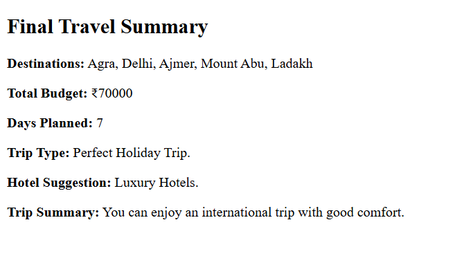
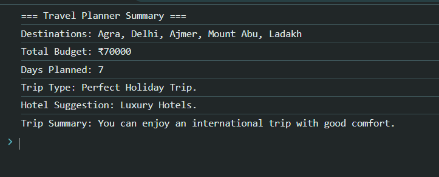

# Project 5 : Smart Travel Planner

 ---

A simple **JavaScript project** that helps users plan their travel by entering destinations, budget, and number of days.  
It also suggests the **trip type** and the best **hotel category** based on user input.  

---

##  Features  
- ✅ Choose **3 to 5 destinations** (with input validation).  
- ✅ Enter **budget** and get customized trip suggestions.  
- ✅ Enter **travel days** and get trip type messages.  
- ✅ Automatic **hotel suggestion** based on budget per day.  
- ✅ **Final summary** displayed on webpage + console.  

---

## ⚙️ Technologies Used  
- **HTML** – Structure  
- **JavaScript** – Logic & Dynamic Output  

---

##  How to Use  
1. Open the `index.html` file in any browser.  
2. Enter the number of destinations (between 3 and 5).  
3. Add destination names (only alphabets allowed).  
4. Enter your **budget** (minimum ₹1000).  
5. Enter the number of **days** for your trip.  
6. Get a **Final Travel Summary** with all details.  

---

##  Example Output  

**Input:**  
- Destinations → Goa, Manali, Jaipur  
- Budget → ₹15,000  
- Days → 5  

**Output:**  

=== Travel Planner Summary ===
- Destinations: Goa, Manali, Jaipur
- Total Budget: ₹15000
- Days Planned: 5
- Trip Type: Perfect Holiday Trip.
- Hotel Suggestion: Mid-range Hotels.
- Trip Summary: You can enjoy a domestic holiday with comfort.

---
##  Author  
- 👤 ***Tausif Kureshi*** 
- 🚀 Passionate Web Developer | Learning Full Stack  
---


## Our Code 

```Html
<!DOCTYPE html>
<html lang="en">

<head>
    <meta charset="UTF-8">
    <meta name="viewport" content="width=device-width, initial-scale=1.0">
    <title>Smart Travel Planner</title>
</head>

<body>
    <p id="output"></p>
    <script>
        let output = document.getElementById("output");

        let limit = parseInt(prompt("How many destinations do you want? (3 to 5)"));
        let destinations = [];

        while (limit < 3 || limit > 5 || isNaN(limit)) {
            limit = parseInt(prompt("Invalid! Please enter a number between 3 and 5."));
        }

        for (let i = 0; i < limit; i++) {
            let destination;
            do {
                destination = prompt(`Enter destination ${i + 1}:`);
                if (!/^[a-zA-Z\s]+$/.test(destination)) {
                    alert("Invalid! Please Enter destination Name...");
                }
            } while (!/^[a-zA-Z\s]+$/.test(destination)); 
            destinations.push(destination);
        }

        let budget = parseInt(prompt("Enter Your Budget.."));
        let budgetSummary;

        while (isNaN(budget) || budget <= 1000) {
            budget = parseInt(prompt("Invalid! Please enter a valid budget (minimum ₹1000):"));
        }

        if (budget >= 1000 && budget <= 10000) {
            budgetSummary = ("Plan a budget-friendly short trip.");
        }
        else if (budget > 10000 && budget <= 50000) {
            budgetSummary =("You can enjoy a domestic holiday with comfort.");
        }
        else if (budget > 50000 && budget <= 100000) {
            budgetSummary = ("You can enjoy an international trip with good comfort.");
        }
        else if (budget > 100000) {
            budgetSummary = "You can enjoy an international luxury holiday.";
        }

        let days = parseInt(prompt("Enter Your Travel Days.."));
        let daysMsg = "";

        while (isNaN(days) || days <= 0) {
            days = parseInt(prompt("Invalid! Please enter a valid Days (greater than 0):"));
        }

        if (days < 3) {
            daysMsg = ("Weekend Getaway.");
        }
        else if (days >= 3 && days <= 7) {
            daysMsg = ("Perfect Holiday Trip.");
        }
        else if (days > 7) {
            daysMsg = ("Extended Vacation.");
        }
        else {
            daysMsg = ("Invalid! Please enter valid budget...");
        }

        function suggestHotel(budget, days) {
            let perDay = budget / days;
            if (perDay < 2000) {
                return "Budget Hotels.";
            }
            else if (perDay >= 2000 && perDay <= 5000) {
                return "Mid-range Hotels.";
            }
            else {
                return "Luxury Hotels.";
            }
        };

        let hotelSuggestion = suggestHotel(budget, days);

        output.innerHTML = `
            <h2>Final Travel Summary</h2>
            <p><b>Destinations:</b> ${destinations.join(", ")}</p>
            <p><b>Total Budget:</b> ₹${budget}</p>
            <p><b>Days Planned:</b> ${days}</p>
            <p><b>Trip Type:</b> ${daysMsg}</p>
            <p><b>Hotel Suggestion:</b> ${hotelSuggestion}</p>
            <p><b>Trip Summary:</b> ${budgetSummary}</p>
        `;
        console.log("=== Travel Planner Summary ===");
        console.log(`Destinations: ${destinations.join(", ")}`);
        console.log(`Total Budget: ₹${budget}`);
        console.log(`Days Planned: ${days}`);
        console.log(`Trip Type: ${daysMsg}`);
        console.log(`Hotel Suggestion: ${hotelSuggestion}`);
        console.log(`Trip Summary: ${budgetSummary}`);
    </script>
</body>

</html>

```

## 📸 Sample Output Screenshot

Below is an actual run of the program in the terminal:






