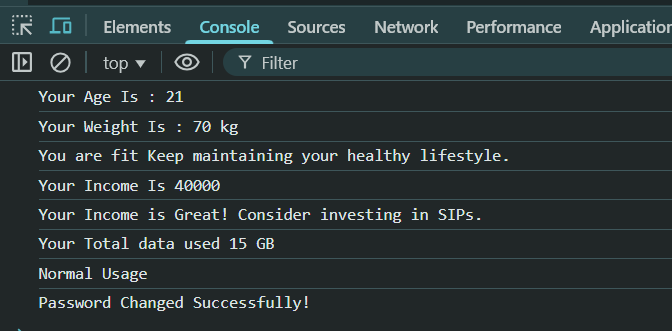

# Project 2 : Smart Life Assistant

 ---

This project is a **multi-feature JavaScript-based tool** embedded in an HTML page that works directly in the browser.  
It acts as a **Smart Life Assistant**, providing different utilities such as:

1. **Fitness Suggestion System**  
2. **Monthly Budget Planner**  
3. **Mobile Data Usage Alert System**  
4. **Change Password Logic**

---

## Features

### 1. Fitness Suggestion System
- **Inputs:** Age & Weight (via prompt)
- **Logic:**  
  - Suggests whether you are fit, underweight, or overweight.
  - Supports age range 5–40 years.
- **Example:**
  - Enter Your Age: 21
  - Enter Your Weight: 70
 → You are fit. Keep maintaining your healthy lifestyle.
---

### 2. Monthly Budget Planner
- **Input:** Monthly income
- **Logic:**  
  - Gives suggestions based on your income range.
- **Example:**
  - Enter your Monthly Income: 40000
  - → Balanced Budget

---

### 3. Mobile Data Usage Alert System
- **Input:** Data used in GB
- **Logic:**  
  - Categorizes usage as Low, Normal, or Heavy.
- **Example:**
  - Enter total data used in a month (in GB): 18
  - → Heavy Usage, consider a bigger plan

---

### 4. Change Password Logic
- **Input:** Old password, new password, confirm password
- **Logic:**  
  - Ensures passwords are not empty, not the same as old password, and match upon confirmation.
- **Example:**
  - Old Password: abc123
  - New Password: xyz789
  - Confirm Password: xyz789
  - → Password Changed Successfully

---

---

##  Technologies Used
- **HTML5** – Structure of the page
- **JavaScript (ES6)** – Business logic, input validation, and decision-making
- **Browser Console & Web Page** – Output display

---

##  How to Use
1. **Clone or Download** the project.
2. Open the HTML file in any modern browser.
3. Follow the prompts in the pop-up dialogs.
4. Check **Browser Console (F12 → Console)** for output.

---

##  Code Structure
```plaintext
index.html
└── <script>
  ├── Fitness Suggestion System
  ├── Monthly Budget Planner
  ├── Mobile Data Usage Alert System
  └── Change Password Logic
```


## Our Code 

```javascript
<!DOCTYPE html>
<html lang="en">

<head>
    <meta charset="UTF-8">
    <meta name="viewport" content="width=device-width, initial-scale=1.0">
    <title>Smart Life Assistant</title>
</head>

<body>
    <script>

        // Fitness Suggestion System

        let age = parseInt(prompt("Enter Your Age : "));
        let weight = parseInt(prompt("Enter Your Weight : "));

        console.log(`Your Age Is : ${age}`);
        console.log(`Your Weight Is : ${weight} kg`);

        if (age < 5 || age > 40) {
            console.log("Sorry..Data not available for this age group");
        }
        else if (
            (age >= 5 && age <= 10) ||
            (age >= 11 && age <= 20) ||
            (age >= 21 && age <= 30) ||
            (age >= 31 && age <= 40)
        ) {
            if (
                (weight >= 15 && weight <= 25) ||
                (weight >= 26 && weight <= 45) ||
                (weight >= 46 && weight <= 65) ||
                (weight >= 66 && weight <= 80)
            ) {
                console.log("You are fit Keep maintaining your healthy lifestyle.");
            } else if (weight < 15) {
                console.log("Your underweight Consider a balanced diet and regular meals");
            } else {
                console.log("Your overweight Try regular exercise and a healthy diet plan.");
            }
        }

        // Monthly Budget Planner
        let income = parseInt(prompt("Enter your Monthly Income : "));

        console.log(`Your Income Is ${income}`);

        if (income <= 0 || isNaN(income)) {
            console.log("Invalid Input! Please Enter The Valid income...");
        }
        else {
            if (income < 10000) {
                console.log("Spend cautiously and save more!");
            }
            else if (income >= 10000 && income < 30000) {
                console.log("Balanced Budget");
            }
            else if (income >= 30000) {
                console.log("Your Income is Great! Consider investing in SIPs.");
            }
        }

        // Mobile Data Usage Alert System
        let gb = parseInt(prompt("Enter total data used in a month (in GB)"));

        console.log(`Your Total data used ${gb} GB`);

        if (gb < 0 || isNaN(gb)) {
            console.log("Invalid Input! Please Enter The Valid GB...");
        }
        else {

            if (gb <= 5) {
                console.log("Low Usage");
            }
            else if (gb > 5 && gb <= 15) {
                console.log("Normal Usage");
            }
            else if (gb > 15) {
                console.log("Heavy Usage, consider a bigger plan");
            }

        }

        // Change Password Logic

        let oldPassword = prompt("Enter your Old Password..");
        let newPassword = prompt("Enter the New Password..");

        if (oldPassword === "" || newPassword === "") {
            console.log("Password Cannot be empty!");
        }
        else if (oldPassword === newPassword) {
            console.log("New password must be different from the old password.");
        }
        else {
            let confirmPassword = prompt("Re-enter the New Password..");

            if (confirmPassword === "") {
                console.log("You must re-enter your password for confirmation!");
            }
            else if (newPassword === confirmPassword) {
                console.log("Password Changed Successfully!");
            }

            else {
                console.log("Password mismatch. Please try again.");
            }
        }

    </script>
</body>

</html>

```

## 📸 Sample Output Screenshot

Below is an actual run of the program in the terminal:



