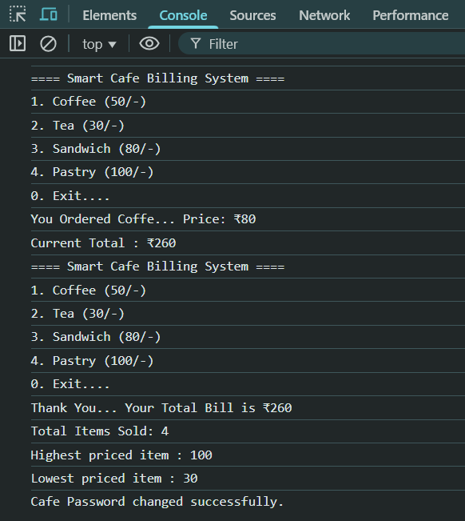

# Project 3 : Smart Cafe Billing System

 ---

A **menu-driven JavaScript project** that simulates a Smart Cafe’s billing system.  
It allows customers to place orders, calculate bills with discounts and GST, view reports, and even change the cafe password.

---

##  Features

 **Menu-driven system** (Place Order, View Bill, View Discount, Change Password, View Report, Exit)  
 **Place Orders** – Coffee, Tea, Sandwich, Pastry  
 **Discount System** –  
- 20% discount if bill > ₹1000  
- 10% discount if bill > ₹500  
 - **GST Calculation** – 5% GST applied on final bill  
 - **Bill Summary** – Subtotal, Discount, GST, and Grand Total  
 - **Password Change Option** (with validation: min 8 chars, 1 uppercase, 1 number, 1 special char)  
 - **Report Section** –  
- Total items sold  
- Highest priced item  
- Lowest priced item  
- Average item price

---

---

##  Menu Options  

1️⃣ Place Order  
2️⃣ View Bill  
3️⃣ View Discount  
4️⃣ Change Cafe Password  
5️⃣ View Report  
0️⃣ Exit  

---

##  Menu

| Item No. | Item Name  | Price (₹) |
|----------|------------|-----------|
| 1        | Coffee     | 50        |
| 2        | Tea        | 30        |
| 3        | Sandwich   | 80        |
| 4        | Pastry     | 100       |
| 0        | Exit       | -         |

---

##  Discount Rules

| Bill Amount | Discount |
|-------------|----------|
| > ₹1000     | 20%      |
| > ₹500      | 10%      |
| ≤ ₹500      | No Discount |

---

## Example Output

**Console Example:**
==== Smart Cafe Billing System ====

1. Coffee (50/-)

2. Tea (30/-)

3. Sandwich (80/-)

4. Pastry (100/-)

Exit....

- Enter Your Choice: 1
- You Ordered Coffee... Price: ₹50
- Current Total: ₹50

 - Thank You... Your Total Bill is ₹180
 - Total Items Sold: 3
 - Highest priced item: ₹100
 - Lowest priced item: ₹30
 - Average priced item: ₹60
---

**HTML Output:**
```html
Thank You... Your Total Bill is ₹180
Total Items Sold: 3
Highest priced item: ₹100
Lowest priced item: ₹30
Average priced item: ₹60
Subtotal: ₹180
Discount: ₹0
After Discount: ₹180
GST (5%): ₹9
Grand Total: ₹189

```
---

 ## Password Change Feature ##
At the end of the billing process, the admin can change the cafe password:

1. Enter old password (1234 by default).

2. Enter new password.

3. If the old password matches, it will be updated successfully.

---

##  How to Run ##

1. Save the HTML & JS code in a .html file.

2. Open the file in any modern browser.

3. Follow the on-screen menu & prompts

---

## Our Code 

### HTML

```HtML
<!DOCTYPE html>
<html lang="en">
<head>
    <meta charset="UTF-8">
    <meta name="viewport" content="width=device-width, initial-scale=1.0">
    <title>Smart Cafe Billing System</title>
</head>
<body>
    <h1>Smart Cafe Billing System</h1>
    <div id="output"></div>
    <script src = "smart-cafe-billing-system.js">
    </script>
</body>
</html>
```
### JavaScript
```javascript
let choice, subchoice;
let totalBill = 0;
let totalItems = 0;
let password = "1234";

let highestPrice = 0;
let lowestPrice = 101;
let gst = 0,discount = 0,itemPrice = 0;

let output = document.getElementById("output");

do {
  console.log("==== Smart Cafe Menu ====");
  console.log("1. Place Order");
  console.log("2. View Bill");
  console.log("3. View Discount");
  console.log("4. Change Cafe Password");
  console.log("5. View Report");

  console.log("0. Exit....\n");

  choice = Number(prompt("Enter Your Choice : "));

  if (choice === 1) {
    do {
      console.log("==== Smart Cafe Billing System ====");
      console.log("1. Coffee (₹50)");
      console.log("2. Tea (₹30)");
      console.log("3. Sandwich (₹80)");
      console.log("4. Pastry (₹100)");
      console.log("0. Exit....\n");

      subchoice = Number(prompt("Enter Your Choice : "));

      if (subchoice === 1) {
        itemPrice = 50;
        totalBill += itemPrice;
        totalItems++;
        console.log("You Ordered Coffe... Price: ₹50");
        console.log(`Current Total : ₹${totalBill}`);
      } 
      else if (subchoice === 2) {
        itemPrice = 30;
        totalBill += itemPrice;
        totalItems++;
        console.log("You Ordered Tea... Price: ₹30");
        console.log(`Current Total : ₹${totalBill}`);
      } 
      else if (subchoice === 3) {
        itemPrice = 80;
        totalBill += itemPrice;
        totalItems++;
        console.log("You Ordered Sandwitch... Price: ₹80");
        console.log(`Current Total : ₹${totalBill}`);
      } 
      else if (subchoice === 4) {
        itemPrice = 100;
        totalBill += itemPrice;
        totalItems++;
        console.log("You Ordered Pastry... Price: ₹100");
        console.log(`Current Total : ₹${totalBill}`);
      } 
      else if (subchoice === 0) {
        console.log("Returning to Main Menu...");
      } 
      else {
        console.log("Invalid Choice...");
      }
      if (itemPrice > highestPrice) {
        highestPrice = itemPrice;
      }

      if (itemPrice < lowestPrice) {
        lowestPrice = itemPrice;
      }
    } while (subchoice !== 0);
  } 
  else if (choice === 2) {
    let finalAmount = totalBill - discount;
    gst = (finalAmount * 5) / 100;
    let grandTotal = finalAmount + gst;

    if (lowestPrice == 101) {
      lowestPrice = 0;
    }

    console.log(`Your Total Bill is ₹${totalBill}`);
    console.log(`Total Items Sold: ${totalItems}`);
    console.log(`Highest priced item : ${highestPrice}`);
    console.log(`Lowest priced item : ${lowestPrice}`);

    document.write(`<h2>==== Bill ====</h2>`);
    document.write(`<p>Subtotal: ₹${totalBill}</p>`);
    document.write(`<p>Discount: ₹${discount}</p>`);
    document.write(`<p>After Discount: ₹${finalAmount}</p>`);
    document.write(`<p>GST (5%): ₹${gst}</p>`);
    document.write(`<b>Grand Total: ₹${grandTotal}</b><br>`);
  } 
  else if (choice === 3) {
    if (totalBill > 1000) {
      discount = (totalBill * 20) / 100;
    } 
    else if (totalBill > 500) {
      discount = (totalBill * 10) / 100;
    } 
    else {
      discount = 0;
    }
    console.log("==== Discount ====");
    console.log(`Subtotal: ₹${totalBill}`);
    console.log(`Discount: ₹${discount.toFixed(2)}`);
    console.log(`After Discount: ₹${totalBill - discount}`);

    document.write(`<h2>==== Discount ====</h2>`);
    document.write(`<p>Subtotal: ₹${totalBill}</p>`);
    document.write(`<p>Discount: ₹${discount.toFixed(2)}</p>`);
    document.write(`<p>After Discount: ₹${totalBill - discount}</p>`);
  } 
  else if (choice === 4) {

    let oldPassword = prompt("Enter old password:");
    let newPassword = prompt("Enter new password:");

    if (oldPassword === password) {
      if (
        newPassword.length >= 8 && /[A-Z]/.test(newPassword) && /[!@#$%^&*]/.test(newPassword) && /\d/.test(newPassword)
      ) {
        password = newPassword;
        console.log("Cafe Password changed successfully.");
        document.write(`<br><b>Cafe Password Changed Successfully...</b>`);
      } else {
        console.log("New password must be at least 8 characters, contain one uppercase letter, one number, and one special character.");
        document.write(`<br><b>New password must be at least 8 characters, contain one uppercase letter, one number, and one special character.</b>`);
      }
    } 
    else {
      console.log("Incorrect old password.");
      document.write(`<br><b>Incorrect old password</b>`);
    }
  } 
  else if (choice === 5) {
    let avgPrice = totalItems > 0 ? (totalBill / totalItems) : "0.00";
    if (lowestPrice == 101) {
      lowestPrice = 0;
    }
    console.log("==== Report ====");
    console.log(`Total Items Sold: ${totalItems}`);
    console.log(`Highest priced item: ₹${highestPrice}`);
    console.log(`Lowest priced item: ₹${lowestPrice}`);
    console.log(`Average priced item: ₹${avgPrice.toFixed(2)}`);

    document.write(`<h2>==== Report ====</h2>`);
    document.write(`<p>Total Items Sold: ${totalItems}</p>`);
    document.write(`<p>Highest priced item: ₹${highestPrice}</p>`);
    document.write(`<p>Lowest priced item: ₹${lowestPrice}</p>`);
    document.write(`<p>Average priced item: ₹${avgPrice.toFixed(2)}</p>`);
  } 
  else if (choice === 0) {
    console.log("Thank You ....");
  } 
  else {
    console.log("Invalid Choice....");
  }
} while (choice !== 0);


```

## 📸 Sample Output Screenshot

Below is an actual run of the program in the terminal:

## HTML WebPage


## Console





