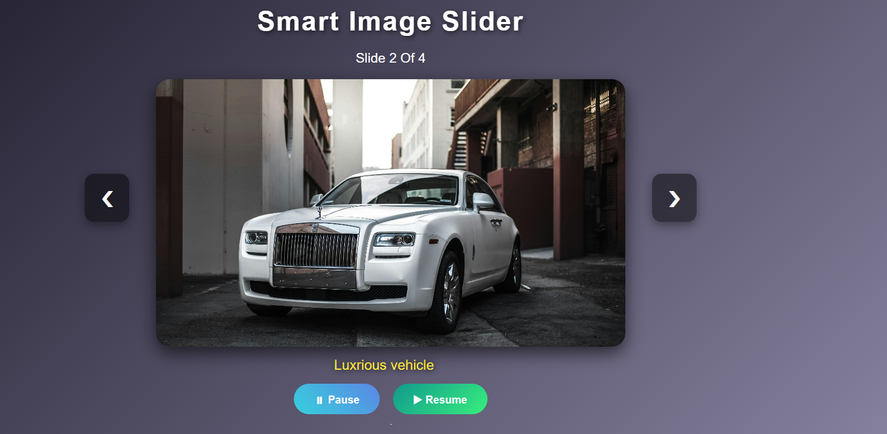
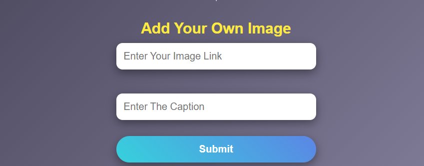
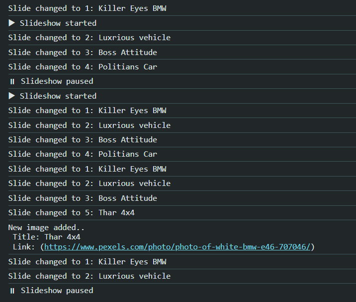

# Project 6 : Smart Image Slider

A simple **Image Slider Web App** built using **HTML, CSS, and JavaScript**.  
This project allows users to view images in a slideshow, navigate between slides, pause/resume autoplay, and even add their own images with captions.  

---

##  Problem Definition

Many times, we need a simple yet interactive way to showcase images on a website.  
This project solves the problem by providing:
- Automatic slideshow
- Manual next/previous navigation
- Pause/Resume control
- Ability to add custom images with captions
- Console output messages for better debugging

---

##  Flow of Program

1. **Image Array Initialization**  
   - A default set of images with captions is stored in an array.

2. **Display Function (`showImage`)**  
   - Shows the current image with its caption and slide count.
   - Logs changes in the console.

3. **Navigation (`nextImg` & `prevImg`)**  
   - Allows moving to the next or previous slide.
   - Wraps around when reaching first/last image.

4. **Slideshow Controls**  
   - `startSlideShow()` → Starts auto-sliding every 3 seconds.  
   - `pauseSlide()` → Stops auto-sliding.  
   - `resumeSlide()` → Resumes auto-sliding.

5. **Add Image Feature (`addImage`)**  
   - Takes a user-provided image URL and caption.
   - Adds it to the slider dynamically.
   - Shows confirmation in console.

6. **Console Output**  
   - Shows logs like:
     - `"Slide changed to X"`
     - `"First Slide / Last Slide reached"`
     - `"New image added..."`

---

##  Technologies Used
- **HTML5** – Structure
- **CSS3** – Styling
- **JavaScript (ES6)** – Functionality & DOM Manipulation

---
# Our Code 
```HTML
<!DOCTYPE html>
<html lang="en">
  <head>
    <meta charset="UTF-8" />
    <meta name="viewport" content="width=device-width, initial-scale=1.0" />
    <title>Smart-Image-Slider</title>
    <link rel="stylesheet" href="./style.css" />
    <style>
      * {
        margin: 0;
        padding: 0;
        box-sizing: border-box;
        font-family: "Poppins", sans-serif;
      }

      body {
        background: linear-gradient(135deg, #1f1c2c, #928dab);
        color: #fff;
        min-height: 100vh;
        display: flex;
        flex-direction: column;
        align-items: center;
      }

      h1 {
        margin: 20px 0;
        text-align: center;
        font-size: 2.5rem;
        font-weight: 700;
        letter-spacing: 2px;
        text-shadow: 2px 2px 8px rgba(0, 0, 0, 0.6);
      }

      .slider-img {
        display: flex;
        justify-content: center;
        align-items: center;
        width: 700px;
        height: 400px;
        overflow: hidden;
        border-radius: 20px;
        box-shadow: 0 10px 25px rgba(0, 0, 0, 0.6);
        position: relative;
      }

      .slider-img img {
        width: 100%;
        height: 100%;
        object-fit: cover;
        border-radius: 20px;
        transition: opacity 0.6s ease-in-out, transform 0.6s ease;
        animation: fadeIn 0.6s ease-in-out;
      }
      .count {
        margin-bottom: 20px;
        font-weight: 300;
        font-size: 20px;
      }

      .caption {
        margin-top: 15px;
        font-size: 1.3rem;
        font-weight: 500;
        text-align: center;
        color: #ffeb3b;
        text-shadow: 1px 1px 10px rgba(0, 0, 0, 0.9);
        animation: fadeIn 0.6s ease-in-out;
      }
      .para {
        display: inline-flex;
        gap: 20px;
      }

      @keyframes fadeIn {
        from {
          opacity: 0;
          transform: translateY(20px);
        }
        to {
          opacity: 1;
          transform: translateY(0);
        }
      }

      .btn {
        display: flex;
        justify-content: center;
        gap: 80px;
        margin-top: 20px;
      }
      .controls {
        display: flex;
        gap: 20px;
      }
      .btn-prev,
      .btn-next {
        position: absolute;
        top: 40%;
        transform: translateY(-50%);
        background: rgba(0, 0, 0, 0.5);
        border: none;
        padding: 15px 25px;
        border-radius: 20%;
        cursor: pointer;
        font-size: 2rem;
        color: white;
        transition: all 0.3s ease;
        box-shadow: 0px 5px 15px rgba(0, 0, 0, 0.4);
      }

      .btn-prev {
        left: 20%;
      }

      .btn-next {
        right: 20%;
      }

      .btn-prev:hover,
      .btn-next:hover {
        background: rgba(0, 0, 0, 0.8);
        transform: translateY(-50%) scale(1.1);
      }

      h3 {
        margin-top: 30px;
        font-size: 1.5rem;
        text-align: center;
        color: #ffeb3b;
      }

      input {
        display: block;
        width: 320px;
        margin: 10px auto;
        padding: 12px;
        border: none;
        outline: none;
        border-radius: 10px;
        font-size: 1rem;
        box-shadow: 0px 5px 15px rgba(0, 0, 0, 0.4);
      }

      input:focus {
        border: 2px solid #ffeb3b;
      }

      button,
      .button {
        display: block;
        margin: 15px auto;
        padding: 12px 30px;
        background: linear-gradient(45deg, #36d1dc, #5b86e5);
        border: none;
        border-radius: 25px;
        color: #fff;
        font-size: 1rem;
        font-weight: bold;
        cursor: pointer;
        transition: all 0.3s ease;
      }

      button:hover {
        transform: translateY(-3px);
        box-shadow: 0px 8px 20px rgba(0, 0, 0, 0.1);
      }
      .pause-btn,
      .button {
        background: (135deg, #6a11cb, #2575fc);
      }

      .resume-btn {
        background: linear-gradient(135deg, #11998e, #38ef7d);
      }
    </style>
  </head>

  <body>
    <h1>Smart Image Slider</h1>
    <p id="count" class="count"></p>
    <div class="slide">
      <button class="btn-prev" onclick="prevImg()">&#10094;</button>
      <div class="slider-img">
        
      </div>
      <button class="btn-next" onclick="nextImg()">&#10095;</button>
    </div>
    <div class="para">
      <p class="caption" id="caption"></p>
      <p class="caption" id="SlideCheck"></p>
    </div>

    <div class="controls">
      <button onclick="pauseSlide()" class="pause-btn">⏸ Pause</button>
      <button onclick="resumeSlide()" class="resume-btn">▶ Resume</button>
    </div>

    <hr />
    <h3>Add Your Own Image</h3>
    <input
      type="text"
      id="imgInput"
      placeholder="Enter Your Image Link"
    /><br />
    <input type="text" id="imgCaption" placeholder="Enter The Caption" />
    <input type="submit" class="button" onclick="addImage()" />
  </body>
  <script>
    const images = [
      { src: "./images/bmw.webp", caption: "Killer Eyes BMW" },
      { src: "./images/rolls-royce.jpg", caption: "Luxrious vehicle" },
      { src: "./images/scropio.jpg", caption: "Boss Attitude" },
      { src: "./images/darkFortuner.jpg", caption: "Politians Car" },
    ];
    let index = 0;
    let slide = document.getElementById("slide");
    let caption = document.getElementById("caption");
    let count = document.getElementById("count");
    let slideCheck = document.getElementById("SlideCheck");

    function showImage(i) {
      slide.src = images[i].src;
      caption.textContent = images[i].caption;
      count.textContent = `Slide ${i + 1} Of ${images.length}`;
      console.log(`Slide changed to ${i + 1}: ${images[i].caption}`);
      if (i == images.length - 1) {
        slideCheck.textContent = `(Last Slide)`;
      } else if (i == 0) {
        slideCheck.textContent = `(First Slide)`;
      } else {
        slideCheck.textContent = ``;
      }
    }
    showImage(index);

    function nextImg() {
      if (index < images.length - 1) {
        index++;
      } else {
        index = 0;
      }
      showImage(index);
    }
    function prevImg() {
      if (index > 0) {
        index--;
      } else {
        index = images.length - 1;
      }
      showImage(index);
    }
    function addImage() {
      let url = document.getElementById("imgInput").value.trim();
      let text = document.getElementById("imgCaption").value.trim();

      if (url === "") {
        alert("Please Enter A image URL");
        return;
      }
      if (text == "") {
        text = "Untitled";
      }
      images.push({ src: url, caption: text });
      index = images.length - 1;
      showImage(index);
      console.log(`New image added..\n Title: ${text} \n Link: (${url})`);
      document.getElementById("imgInput").value = "";
      document.getElementById("imgCaption").value = "";
    }
    function startSlideShow() {
      slideInterval = setInterval(nextImg, 3000);
      console.log("▶ Slideshow started");
    }
    function pauseSlide() {
      clearInterval(slideInterval);
      console.log("⏸ Slideshow paused");
    }
    function resumeSlide() {
      startSlideShow();
    }

    startSlideShow();
  </script>
</html>

```
## 🖼 Output Screenshots

### 🔹 Main Slider Interface



### 🔹 (Console Log)



---

## 🎯 How to Run
1. Clone this repository:
   ```bash
   git clone https://github.com/your-username/smart-image-slider.git

