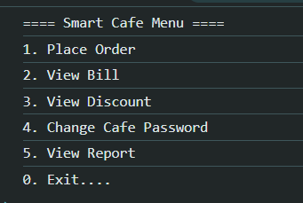

# Project 3 : Smart Cafe Billing System

 ---

A simple **Cafe Billing System** built in JavaScript that allows users to order items, calculate bills, apply discounts, GST, and generate a sales report — all through a menu-driven program.

---

##  Features

- **Menu-driven billing system**
- Add multiple items in a single session
- Automatic calculation of:
  - Total bill
  - Discounts (10% for bills above ₹500, 20% for bills above ₹1000)
  - GST (5% after discount)
- Tracks:
  - Total items sold
  - Highest priced item
  - Lowest priced item
  - Average price per item
- **Password change feature** for cafe admin
- Real-time bill updates in console & HTML page

---

##  Menu

| Item No. | Item Name  | Price (₹) |
|----------|------------|-----------|
| 1        | Coffee     | 50        |
| 2        | Tea        | 30        |
| 3        | Sandwich   | 80        |
| 4        | Pastry     | 100       |
| 0        | Exit       | -         |

---

##  Discount Rules

| Bill Amount | Discount |
|-------------|----------|
| > ₹1000     | 20%      |
| > ₹500      | 10%      |
| ≤ ₹500      | No Discount |

---

## Example Output

**Console Example:**
==== Smart Cafe Billing System ====

1. Coffee (50/-)

2. Tea (30/-)

3. Sandwich (80/-)

4. Pastry (100/-)

Exit....

- Enter Your Choice: 1
- You Ordered Coffee... Price: ₹50
- Current Total: ₹50

 - Thank You... Your Total Bill is ₹180
 - Total Items Sold: 3
 - Highest priced item: ₹100
 - Lowest priced item: ₹30
 - Average priced item: ₹60
---

**HTML Output:**
```html
Thank You... Your Total Bill is ₹180
Total Items Sold: 3
Highest priced item: ₹100
Lowest priced item: ₹30
Average priced item: ₹60
Subtotal: ₹180
Discount: ₹0
After Discount: ₹180
GST (5%): ₹9
Grand Total: ₹189

```
---

 ## Password Change Feature ##
At the end of the billing process, the admin can change the cafe password:

1. Enter old password (1234 by default).

2. Enter new password.

3. If the old password matches, it will be updated successfully.

---

##  How to Run ##

1. Save the HTML & JS code in a .html file.

2. Open the file in any modern browser.

3. Follow the on-screen menu & prompts

---

## Our Code 

### HTML

```HtML
<!DOCTYPE html>
<html lang="en">
<head>
    <meta charset="UTF-8">
    <meta name="viewport" content="width=device-width, initial-scale=1.0">
    <title>Smart Cafe Billing System</title>
</head>
<body>
    <h1>Smart Cafe Billing System</h1>
    <div id="output"></div>
    <script src = "smart-cafe-billing-system.js">
    </script>
</body>
</html>
```
### JavaScript
```javascript
let choice;
let totalBill = 0;
let totalItems = 0;

let highestPrice = 0;
let lowestPrice = 101;
let gst = 0, discount = 0, itemPrice=0;

let output = document.getElementById("output");

do {
  console.log("==== Smart Cafe Billing System ====");
  console.log("1. Coffee (50/-)");
  console.log("2. Tea (30/-)");
  console.log("3. Sandwich (80/-)");
  console.log("4. Pastry (100/-)");
  console.log("0. Exit....\n");

  choice = Number(prompt("Enter Your Choice : "));

  if (choice === 1) {
    itemPrice = 50;
    totalBill += itemPrice;
    totalItems++;
    console.log("You Ordered Coffe... Price: ₹80");
    console.log(`Current Total : ₹${totalBill}`);
  } else if (choice === 2) {
    itemPrice = 30;
    totalBill += itemPrice;
    totalItems++;
    console.log("You Ordered Tea... Price: ₹30");
    console.log(`Current Total : ₹${totalBill}`);
  } else if (choice === 3) {
    itemPrice = 80;
    totalBill += itemPrice;
    totalItems++;
    console.log("You Ordered Sandwitch... Price: ₹80");
    console.log(`Current Total : ₹${totalBill}`);
  } else if (choice === 4) {
    itemPrice = 100;
    totalBill += itemPrice;
    totalItems++;
    console.log("You Ordered Pastry... Price: ₹100");
    console.log(`Current Total : ₹${totalBill}`);
  } else if (choice === 0) {
    if(lowestPrice == 101){
      lowestPrice = 0;
    }
    if (totalBill > 1000) {
      discount = (totalBill * 20) / 100;
    } 
    else if (totalBill > 500) {
      discount = (totalBill * 10) / 100;
    } 
    else {
      discount = 0;
    }

    let finalAmount = totalBill - discount;
    gst = (finalAmount * 5) / 100;
    let grandTotal = finalAmount + gst;
    
    console.log(`Thank You... Your Total Bill is ₹${totalBill}`);
    console.log(`Total Items Sold: ${totalItems}`);
    console.log(`Highest priced item : ${highestPrice}`);
    console.log(`Lowest priced item : ${lowestPrice}`);

    output.innerHTML += `<br><b>Thank You... Your Total Bill is ₹${totalBill}</b><br>`;
    output.innerHTML += `Total Items Sold: ${totalItems}<br>`;
    output.innerHTML += `Highest priced item: ₹${highestPrice}<br>`;
    output.innerHTML += `Lowest priced item: ₹${lowestPrice}<br>`;

    output.innerHTML += `<br><b>GST & Discount</b><br>`;
    output.innerHTML += `Subtotal: ₹${totalBill}<br>`;
    output.innerHTML += `Discount: ₹${discount}<br>`;
    output.innerHTML += `After Discount: ₹${finalAmount}<br>`;
    output.innerHTML += `GST (5%): ₹${gst}<br>`;
    output.innerHTML += `<b>Grand Total: ₹${grandTotal}</b><br>`;

    let avgPrice = totalBill / totalItems;

    output.innerHTML += `<br><b>Report</b><br>`;
    output.innerHTML += `Total Items Sold: ${totalItems}<br>`;
    output.innerHTML += `Highest priced item: ₹${highestPrice}<br>`;
    output.innerHTML += `Lowest priced item: ₹${lowestPrice}<br>`;
    output.innerHTML += `Average priced item: ₹${avgPrice}<br>`;

    output.innerHTML += `<br><b>Cafe Password Changed Successfully...</b><br>`;


  } else {
    console.log("Invalid Choice...");
  }
  if (itemPrice > highestPrice) {
      highestPrice = itemPrice;
    }

  if (itemPrice < lowestPrice) {
      lowestPrice = itemPrice;
    }
} while (choice !== 0);

let password = "1234";

        let oldPassword = prompt("Enter old password:");
        let newPassword = prompt("Enter new password:");

        if (oldPassword === password) { 
            password = newPassword;
            console.log("Cafe Password changed successfully.");
        } 
        else {
            console.log("Incorrect old password.");
        }


```

## 📸 Sample Output Screenshot

Below is an actual run of the program in the terminal:

## HTML WebPage


## Console



