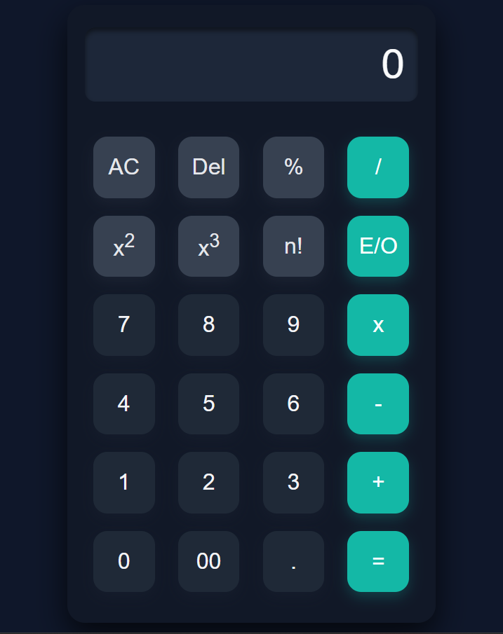

# Project 4 : Smart Calculator

 ---

A modern and stylish **Smart Calculator** built using **HTML, CSS, and JavaScript**.  
It supports basic arithmetic operations with a clean UI and smooth button effects.  

---

##  Features

-  Perform basic operations: **Addition, Subtraction, Multiplication, Division, Modulus (%)**
-  **Delete (Del)** button to remove last input
-  **AC (All Clear)** button to reset calculator
-  Supports **decimal numbers**
-  **Limit input length** to 8 digits per number
-  Responsive design with a **dark theme**
-  Smooth **hover & click animations**

---

## Technologies Used

- **HTML5** → structure  
- **CSS3** → styling & animations  
- **JavaScript (JS)** → calculator logic  

## Author

- Created By Tausif Kureshi.

## Our Code 

```javascript
<!DOCTYPE html>
<html lang="en">

<head>
    <meta charset="UTF-8">
    <meta name="viewport" content="width=device-width, initial-scale=1.0">
    <title>Smart Calculator</title>
    <link rel="stylesheet" href="./style.css">
    <style>
        * {
            margin: 0;
            padding: 0;
            box-sizing: border-box;
            font-family: Arial, Helvetica, sans-serif;
        }

        body {
            background-color: #0f172a;
            min-height: 100vh;
            display: flex;
            align-items: center;
            justify-content: center;
        }

        .d-flex {
            display: flex;
        }

        .align-item-center {
            align-items: center;
        }

        .container {
            width: 420px;
            background-color: #111827;
            display: flex;
            align-items: center;
            justify-content: center;
            border-radius: 20px;
            box-shadow: 0 15px 35px rgba(0, 0, 0, 0.7);
            padding: 25px 20px;
        }

        .smart-calculator {
            display: flex;
            flex-direction: column;
            align-items: center;
            justify-content: center;
        }

        .display input {
            width: 380px;
            margin-bottom: 20px;
            background: rgba(30, 41, 59, 0.9);
            font-size: 3rem;
            border-radius: 12px;
            text-align: right;
            color: #f9fafb;
            padding: 15px;
            border: none;
            outline: none;
            box-shadow: inset 0 4px 6px rgba(0, 0, 0, 0.5);
        }

        .display input::placeholder {
            color: #f9fafb;
        }

        .btn-format {
            display: flex;
            padding-top: 10px;
            flex-direction: column;
            justify-content: space-between;
            width: 100%;
        }

        .btn-line {
            display: flex;
            justify-content: space-between;
            width: 100%;
        }

        .btn {
            height: 70px;
            width: 70px;
            border: none;
            font-size: 1.6rem;
            margin: 10px;
            border-radius: 16px;
            transition: all 0.3s ease;
            cursor: pointer;
        }

        .btn:hover {
            transform: scale(1.08);
            filter: brightness(1.2);
        }

        .btn:active {
            transform: scale(0.95);
        }

        .operate-btn {
            background-color: #14b8a6;
            color: #fff;
            box-shadow: 0 4px 10px rgba(20, 184, 166, 0.4);
        }

        .others-btn {
            background-color: #374151;
            color: #e5e7eb;
            box-shadow: 0 4px 10px rgba(55, 65, 81, 0.4);
        }

        .numbers {
            background: #1f2937;
            color: #f3f4f6;
            box-shadow: 0 4px 10px rgba(31, 41, 55, 0.5);
        }

        .btn-lg {
            width: 150px;
            border-radius: 16px;
        }
    </style>

</head>

<body>
    <div id="output"></div>

    <div class="container">
        <div class="smart-calculator">
            <form>
                <div class="display ">
                    <input type="name" class="d-flex align-item-center" id="display" placeholder="0" disabled>
                </div>
                <div class="btn-format ">
                    <div class="btn-line">
                        <button type="button" class="btn others-btn" onclick="clearDisplay()">AC</button>
                        <button type="button" class="btn others-btn" onclick="lastDel()">Del</button>
                        <button type="button" class="btn others-btn" onclick="setOperator('%')">%</button>
                        <button type="button" class="btn operate-btn" onclick="setOperator('/')">/</button>
                    </div>
                    <div class="btn-line">
                        <button type="button" class="btn numbers" onclick="insertValue('7')">7</button>
                        <button type="button" class="btn numbers" onclick="insertValue('8')">8</button>
                        <button type="button" class="btn numbers" onclick="insertValue('9')">9</button>
                        <button type="button" class="btn operate-btn" onclick="setOperator('x')">x</button>
                    </div>
                    <div class="btn-line">
                        <button type="button" class="btn numbers" onclick="insertValue('4')">4</button>
                        <button type="button" class="btn numbers" onclick="insertValue('5')">5</button>
                        <button type="button" class="btn numbers" onclick="insertValue('6')">6</button>
                        <button type="button" class="btn operate-btn" onclick="setOperator('-')">-</button>
                    </div>
                    <div class="btn-line">
                        <button type="button" class="btn numbers" onclick="insertValue('1')">1</button>
                        <button type="button" class="btn numbers" onclick="insertValue('2')">2</button>
                        <button type="button" class="btn numbers" onclick="insertValue('3')">3</button>
                        <button type="button" class="btn operate-btn" onclick="setOperator('+')">+</button>
                    </div>
                    <div class="btn-line">
                        <button type="button" class="btn numbers" onclick="insertValue('0')">0</button>
                        <button type="button" class="btn numbers" onclick="insertValue('00')">00</button>
                        <button type="button" class="btn numbers" onclick="insertValue('.')">.</button>
                        <button type="button" class="btn operate-btn" onclick="calculate()">=</button>
                    </div>

                </div>

            </form>
        </div>
    </div>


    <script>
        let display = document.getElementById("display");
        let num1 = "";
        let num2 = "";
        let operator = "";

        function insertValue(value) {
            if (operator === "") {
                if (num1.length < 8) {
                    num1 += value;
                    display.value = num1;
                }
            } else {
                if (num2.length < 8) {
                    num2 += value;
                    display.value = num1 + " " + operator + " " + num2;
                }
            }
        }

        function clearDisplay() {
            num1 = "";
            num2 = "";
            operator = "";
            display.value = "";
        }

        function setOperator(op) {
            if (num1 !== "") {
                operator = op;
                display.value = num1 + " " + operator;
            }
        }
        function calculate() {
            let result = 0;
            let n1 = parseFloat(num1);
            let n2 = parseFloat(num2);

            if (operator === "+") result = n1 + n2;
            else if (operator === "-") result = n1 - n2;
            else if (operator === "x") result = n1 * n2;
            else if (operator === "/") result = n1 / n2;
            else if (operator === "%") result = n1 % n2;

            display.value = result;
            num1 = result.toString();
            num2 = "";
            operator = "";
        }
        function lastDel() {
            if (operator === "") {
                num1 = num1.slice(0, -1);
                display.value = num1;
            }
            else if (operator !== "" && num2 === "") {
                operator = "";
                display.value = num1;

            }
            else {
                num2 = num2.slice(0, -1);
                display.value = num1 + " " + operator + " " + num2;

            }

        };
    </script>
</body>

</html>
```

## 📸 Sample Output Screenshot

Below is an actual run of the program in the terminal:




